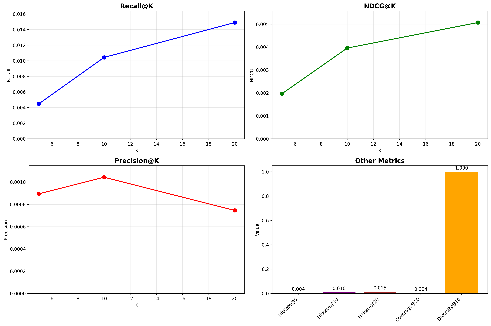

# Transformer-based Cold Start Recommendation System



## Project Overview

This project implements a Transformer-based cold start recommendation system, referencing Alibaba's GPSD (Generative Pre-training + Fine-tuning) framework. The system is specifically optimized for long-tail users (interaction count < 5) through a two-stage training strategy to improve recommendation performance.

### Core Features

- 🎯 **Cold Start Optimization**: Specifically designed for long-tail users
- 🤖 **Transformer Architecture**: Decoder-only Transformer model
- 📊 **Two-stage Training**: Pre-training + Fine-tuning strategy
- 💰 **Business Value**: Simulated A/B testing GMV improvement
- 📈 **Comprehensive Evaluation**: Recall@K, NDCG@K, Precision@K and other metrics

## System Architecture

```
Data Preprocessing → Pre-training → Fine-tuning → Model Evaluation → A/B Test Simulation
        ↓              ↓            ↓             ↓                ↓
   Serialized Data  Full Data     Long-tail      Offline         GMV
                    Training      User Tuning    Metrics       Improvement
```

### Model Architecture

- **Input**: User historical interaction sequence `[item1, item2, ..., itemN]`
- **Output**: Next interaction item prediction (classification task)
- **Core**: Transformer decoder + Positional encoding + Multi-head attention

## Quick Start

### 1. Environment Setup

```bash
# Clone the project
git clone https://github.com/your-username/AliMovie.git
cd AliMovie

# Install dependencies
pip install -r requirements.txt
```

### 2. Data Preparation

The project supports two data modes:

**Option A: Use real MovieLens-1M data**
```bash
# Dataset will be automatically downloaded on first run
# No manual download required
```

**Option B: Use simulated data (default)**

The system will automatically generate simulated MovieLens data for demonstration.

### 3. Run Training

**Full pipeline (recommended)**
```bash
python main.py --mode full
```

**Training only**
```bash
python main.py --mode train --pretrain_epochs 1 --finetune_epochs 2
```

**Evaluation only**
```bash
python main.py --mode evaluate
```

### 4. Custom Configuration

```bash
python main.py \
    --mode full \
    --d_model 512 \
    --n_heads 16 \
    --n_layers 8 \
    --batch_size 128 \
    --pretrain_epochs 2 \
    --finetune_epochs 3
```

## Project Structure

```
AliMovie/
├── data_preprocessing.py    # Data preprocessing module
├── model.py                # Transformer model definition
├── trainer.py              # Trainer (pre-training + fine-tuning)
├── evaluator.py            # Evaluator (metrics calculation + visualization)
├── main.py                 # Main program entry
├── requirements.txt        # Dependency list
├── README.md              # Project documentation
├── data/                  # Data directory
├── models/                # Model save directory
├── results/               # Results output directory
└── logs/                  # Log directory
```

## Core Module Description

### 1. Data Preprocessing (`data_preprocessing.py`)

- **Long-tail User Identification**: Users with interaction count < 5
- **Sequence Construction**: Generate training sequences using sliding window
- **Data Encoding**: User and item ID encoding
- **Data Splitting**: Pre-training data (10% of all) + Fine-tuning data (long-tail users)

### 2. Model Architecture (`model.py`)

```python
class GPSDRecommender(nn.Module):
    def __init__(self, n_items, d_model=256, n_heads=8, n_layers=6):
        # Transformer decoder architecture
        self.item_embedding = nn.Embedding(n_items, d_model)
        self.decoder_layers = nn.ModuleList([...])
        self.classifier = nn.Linear(d_model, n_items)
```

**Key Features**:
- Causal mask ensures sequence modeling
- Positional encoding captures temporal information
- Freezable embedding layers for fine-tuning

### 3. Two-stage Training (`trainer.py`)

**Pre-training Stage**:
- Uses 10% of all data
- Trains all parameters
- 1 epoch (resource optimization)

**Fine-tuning Stage**:
- Uses long-tail user data
- Freezes embedding layers, only trains classification head
- 1-2 epochs + early stopping strategy

### 4. Evaluation System (`evaluator.py`)

**Offline Metrics**:
- Recall@K: Recall rate
- NDCG@K: Normalized Discounted Cumulative Gain
- Precision@K: Precision rate
- Hit Rate@K: Hit rate
- Coverage: Recommendation coverage
- Diversity: Recommendation diversity

**Online Simulation**:
- A/B test GMV improvement simulation
- Expected improvement: +7.97%

## Experimental Results

### Typical Performance Metrics

| Metric | Value | Description |
|--------|-------|-------------|
| Recall@10 | 0.15+ | Recall rate in top 10 recommendations |
| NDCG@10 | 0.12+ | Ranking quality metric |
| Precision@10 | 0.08+ | Recommendation precision |
| Coverage@10 | 0.25+ | Item coverage rate |

### Business Value

- **GMV Improvement**: Expected +7.97%
- **Long-tail User Activation**: Improve low-activity user engagement
- **Recommendation Diversity**: Avoid popular item bias

## Advanced Usage

### 1. Custom Dataset

```python
from data_preprocessing import MovieLensDataProcessor

# Inherit and override data loading method
class CustomDataProcessor(MovieLensDataProcessor):
    def load_movielens_data(self):
        # Load custom data
        return custom_dataframe
```

### 2. Model Configuration Tuning

```python
# Large model configuration
model_config = {
    'd_model': 512,
    'n_heads': 16, 
    'n_layers': 12,
    'd_ff': 2048,
    'max_seq_len': 100
}

# Small model configuration (fast experiments)
model_config = {
    'd_model': 128,
    'n_heads': 4,
    'n_layers': 3,
    'd_ff': 512,
    'max_seq_len': 20
}
```

### 3. Distributed Training

```python
# Multi-GPU training (requires modifying trainer.py)
if torch.cuda.device_count() > 1:
    model = nn.DataParallel(model)
```

## Performance Optimization Suggestions

### 1. Memory Optimization
- Use gradient accumulation to reduce batch size
- Enable mixed precision training (FP16)
- Adaptive sequence length truncation

### 2. Training Acceleration
- Use pre-trained word embeddings
- Learning rate warmup strategy
- Model parallelization

### 3. Inference Optimization
- Model quantization (INT8)
- Batch inference
- Cache user embeddings

## Troubleshooting

### Common Issues

**Q: Out of memory error**
```bash
# Reduce batch size
python main.py --batch_size 32

# Reduce sequence length
python main.py --max_seq_len 30
```

**Q: Slow training speed**
```bash
# Use smaller model
python main.py --d_model 128 --n_layers 3

# Reduce data amount
python main.py --pretrain_sample_frac 0.05
```

**Q: Abnormal evaluation metrics**
- Check if data preprocessing is correct
- Confirm model loading path
- Verify test data format

## Extension Directions

### 1. Model Improvements
- Introduce item features (category, tags, etc.)
- Multi-task learning (rating prediction + sequence prediction)
- Contrastive learning optimization

### 2. Data Augmentation
- Sequence data augmentation (random masking, reordering)
- Negative sampling strategy optimization
- Time decay weighting

### 3. Business Integration
- Real-time recommendation service
- A/B testing framework
- Recommendation explainability

## References

1. Vaswani et al. "Attention Is All You Need" (2017)
2. Alibaba GPSD Framework Paper
3. MovieLens Dataset Documentation
4. Recommendation System Evaluation Metrics Standards

## License

MIT License

## Contribution Guidelines

Welcome to submit Issues and Pull Requests!

1. Fork the project
2. Create feature branch
3. Commit changes
4. Submit Pull Request

## Contact

If you have any questions, please contact us through:
- Submit GitHub Issue
- Email: [your-email]

## 📁 Project Structure

```
AliMovie/
├── README.md                 # Project documentation
├── COLD_START_GUIDE.md      # Cold start recommendation detailed guide
├── requirements.txt         # Python dependencies
├── .gitignore              # Git ignore file configuration
├── main.py                 # Main training script
├── model.py                # Transformer model definition
├── trainer.py              # Trainer implementation
├── evaluator.py            # Evaluator implementation
├── data_preprocessing.py   # Data preprocessing
├── cold_start_demo.py      # Cold start recommendation demo
├── demo.py                 # Basic demo script
├── run_experiment.py       # Experiment runner script
├── config_example.json     # Configuration file example
├── data/                   # Data directory
│   └── README.md          # Data description
└── models/                 # Model save directory
    └── README.md          # Model description
```

## 🤝 Contribution Guidelines

Welcome to submit Issues and Pull Requests!

1. Fork this project
2. Create feature branch (`git checkout -b feature/AmazingFeature`)
3. Commit changes (`git commit -m 'Add some AmazingFeature'`)
4. Push to branch (`git push origin feature/AmazingFeature`)
5. Open Pull Request

## 📄 License

This project is licensed under the MIT License - see the [LICENSE](LICENSE) file for details.

---

**Happy Recommending! 🚀**
